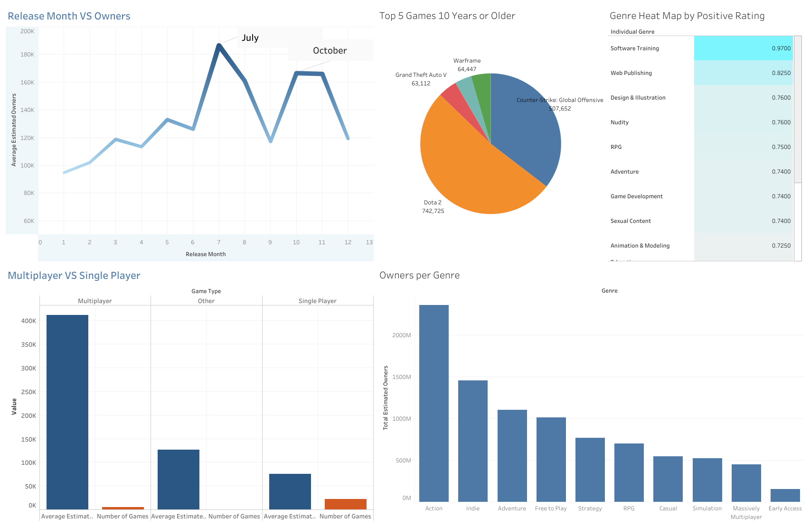

# SQL-Steam-Data Project

## Overview
This repository contains a comprehensive data analysis project focused on the Steam Store, a leading global platform for video game producers to sell and market their games online, owned by Valve Corporation. The project utilizes raw and cleaned datasets from Steam Store and Steam Spy to uncover consumer trends and patterns, aiming to enhance marketing strategies and boost sales.

#### [Steam Data Analysis Log Report](docs/Steam%20Store%20Log%20Report_%2007_21_2025.pdf) This includes a detailed log report of my start to finish process of the data analysis.

### [Watch this video on YouTube](https://youtu.be/d0VJXCp7rcg)

## Project Details
- **Objective**: Analyze consumer trends on the Steam Store to improve marketing and increase sales.
- **Stakeholders**: Gabe Logan (Founder), Valve Corporation Marketing Department, Valve Marketing Analytics Team, and global Steam users/gamers.
- **Dataset Sources**:
  - [Uncleaned: Steam Store Raw Data](https://www.kaggle.com/datasets/nikdavis/steam-store-raw)
  - [Cleaned: Steam Store Games](https://www.kaggle.com/datasets/nikdavis/steam-store-games)
- **Tools Used**:
  - SQL (BigQuery) for data import, cleaning, and analysis
  - Excel for quick visualizations and reference
  - Tableau for advanced visualizations and recommendations

## Data Analysis Process
[Big Query- Sql Queries for Analysis](queries/Steam_Store_Data_Analysis_Query.sql) Big Query- SQL Query Code used for Data Analysis

The project follows a structured data analytics approach:
1. **Ask**: Define the business task and key questions (e.g., popular genres, price vs. ownership, multiplayer vs. single-player trends).
2. **Prepare**: Import Steam datasets into BigQuery.
3. **Process**: Clean data by fixing types, removing nulls/duplicates, and eliminating irrelevant columns.
4. **Analyze**: Generate insights using SQL queries (e.g., genre popularity, release timing effects).
5. **Share**: Create visualizations in Excel and Tableau to share findings (note: visualizations not included here but can be added).
6. **Act**: Apply insights to recommend marketing strategies.

## Key Insights and Visuals
### Visualizations
#### Dashboard Overview

*Summary of key trends including genre popularity and ownership.*

### Insights
- Popular Genres: Action, Indie, Free-to-Play, and Strategy lead in ownership.
- Price vs. Ownership: Lower prices don’t directly correlate with higher ownership.
- Multiplayer Games: Show 5x higher average ownership than single-player games.
- Release Timing: Sales peak in July, October, and November, suggesting seasonal campaign opportunities.
- Top Games: Multiplayer, free-to-play Action games (e.g., by Valve) dominate ownership.
- Concurrent Users: High engagement in top games offers DLC marketing potential.
- Playtime: MMO and Free-to-Play genres, plus software categories, show high playtime.
- Ratings: Non-game software (e.g., Training, Web Publishing) scores highest in positive ratings.

## Recommendations
- Target marketing on Action, Indie, Adventure, and Free-to-Play genres.
- Promote multiplayer games emphasizing social connectivity.
- Market non-gaming tools like software training and design tools.
- Launch campaigns in July, October, and November with holiday themes.
- Support top games with DLCs to boost revenue.
- Marketing efforts on Steam should prioritize Action, Indie, and Multiplayer titles, especially during seasonal peaks like July and October. See full insights below.
- [Final Recommendations Explained](docs/Steam_Data_Analysis_Final_Thoughts.pdf)

## Files
- `docs/`: [Google Docs- Log Report of Data Analysis](docs/Steam%20Store%20Log%20Report_%2007_21_2025.pdf)
- `queries/`: [Big Query SQL scripts used for data analysis](queries/Steam_Store_Data_Analysis_Query.sql)
- `tableau_viz/`: [Raw Packaged Work Book](tableau_viz/Steam%20Store%20DashBoard.twbx)

## How to Contribute
Feel free to fork this repository, submit issues, or propose enhancements. Contributions to improve data cleaning, analysis, or visualizations are welcome!
